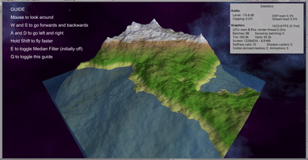
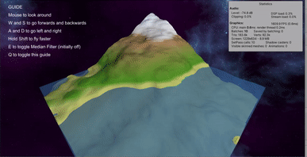
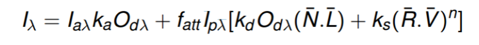
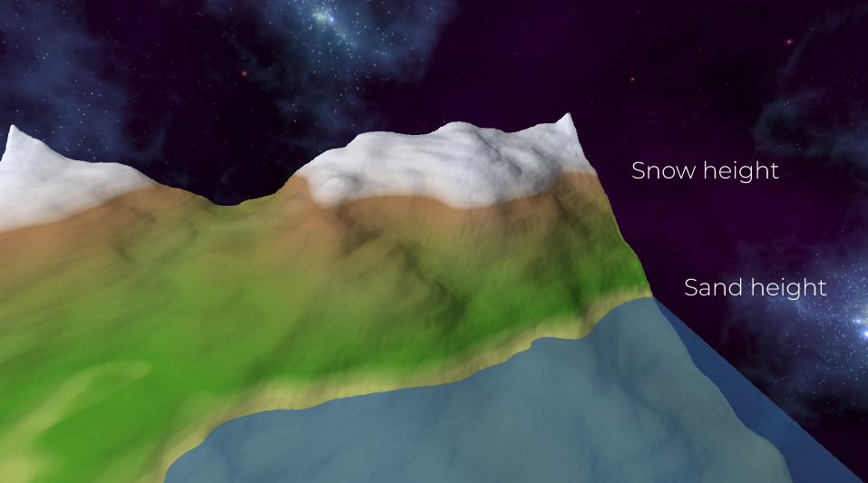

**The University of Melbourne**
# COMP30019 – Graphics and Interaction

# Project-1 README

Remember that _"this document"_ should be `well written` and formatted **appropriately**. It should be easily readable within Github. Modify this file... 
this is just an example of different formating tools available for you. For help with the format you can find a guide [here](https://docs.github.com/en/github/writing-on-github).

## Table of contents
* [Team Members](#team-members)
* [General Info](#general-info)
* [Technologies](#technologies)
* [Diamond-Square implementation](#diamond-square-implementation)
* [Camera Motion](#camera-motion)
* [Median Filter](#median-filter)
* [Terrain Vertex Shader](#Terrain Vertex Shader)
* [Water Shader](#Water Shader)

## Team Members

| Name | Task | State |
| :---         |     :---:      |          ---: |
| Nathan Rearick  | Diamond Square     |   |
| Nathan Rearick  | Camera Movement     |   |
| Lucien Lu    | Water and Water Shader      |   |
| Lucien Lu    | Scene Manager    |   |
| Lucien Lu    | Median Filter    |   |
| Timmy Truong    | Shaders     |   |
| Timmy Truong    | Sun     |   |


## General info
This is project - 1 ...
Project 1 is an implementation of the Diamond Square algorithm and custom HLSL shaders that demonstrates phong shading. This project is based on generating a fractal landscape using the DS algorithm. This implementation is made by, Lucien Lu, Nathan Rearick, Timmy Truong.
	
## Technologies
Project is created with:
* Unity 2019.4.3f1
* Nvidia ShadowPlay

## Diamond-Square implementation
For the Diamond Square algorithm, the corners of the grid is set to a random value in a specified range. Then the centre of these 4 points is set to the average of the heights of the corners, this is known as the diamond step. Then for each 'diamond', the center of the vertices is set to the average of the diamond's points (Note: For points on the edge, only 3 points are used), this is the square step. After both of these steps are completed, the grid is then split into 4 equally sized grids, and the algorithm repeats for each grid. This processes continues until the size of each grid has a side length of 1, which results in every point in the original grid to be designated a specific height.

This section of code shows the use of a double nested for loop which will inspect every grid in the original grid, conduct both steps on itself, then essentially 'splits' into 4 smaller grids, this is repeated n amount of times. The reason why the original square grid has to have ((2^n) + 1) points per row is because it is the only set of dimensions that allow for the grid to evenly divide into 4 smaller grids until each length is 1.
```c#
    for(int i = 0; i < nVal; i++)
		{
            int sqrtSquares = (int)Math.Pow(2, i);
            float divided = (gridSize - 1) / sqrtSquares;
            for(int j = 0; j < sqrtSquares; j++)
			{
		//  Every row of squares
                for(int k = 0; k < sqrtSquares; k++)
				{
		    //  Every square in the row
                    Vector2 p1 = new Vector2(k, j) * divided;
                    Vector2 p3 = new Vector2(k + 1, j + 1) * divided;
                    Step(p1, p3);
				}
			}
            LowerHeight();
		}
```
A single method was used to find the average height of related points:
To find the few corner points of interest, a displacement vector between a given corner and the local centre point of the grid is created. The corners are found by adding the deplacement vector with the local centre point, then rotating the displacement vector by 90 degrees after each time. If the inspected point is inside the original grid, its height is then added to a sum, so that the mean of the valid points can be calculated. Thus, the new point's height will equal to the mean height of these points, plus a random value (the range of this random value decreases after every full loop).

Code:

```c#
    float AverageHeight(Vector2 pV, Vector2 mp)
	{
        float sum = 0;
        int count = 0;

        //  Get the displacement vector between the mid point and the corner point
        Vector2 dV = pV - mp;

        float[] angles = new[] {
            0f, Mathf.PI * 0.5f, Mathf.PI, Mathf.PI * 1.5f
        };
        foreach (float theta in angles)
        {
            Vector2 translation = rotateVector(dV, theta);
            Vector2 newV = pV + translation;
            if (inBounds(newV))
			{
                sum += verts.GetHeight(newV);
                count++;
			}
		}
        if(count == 0)
		{
            return 0;
		}
        return sum / count;
	}
    Vector2 rotateVector(Vector2 v, float theta)
    {
        return new Vector2(Mathf.Round((v.x * Mathf.Cos(theta)) - (v.y * Mathf.Sin(theta))), 
            Mathf.Round((v.x * Mathf.Sin(theta)) + (v.y * Mathf.Cos(theta))));
    }
 ```

## Camera Motion
The camera motion implemented is a flying vehicle first person camera, the camera is allowed to go anywhere inside the bounds of the terrain and above the ground.
The camera is attached to a player object which rotates accordingly to the mouse x axis input, controllong the yaw of the camera. The camera itself rotates up and down independently of the player object, controlling the pitch of the camera.

The code used for rotating the camera using the mouse implements the following update method:

```c#
void Update()
    {
        float mouseX = Input.GetAxis("Mouse X") * mouseSensitivity;
        float mouseY = Input.GetAxis("Mouse Y") * mouseSensitivity;

        xRotation -= mouseY;
        xRotation = Mathf.Clamp(xRotation, -90f, 90f);
        transform.localRotation = Quaternion.Euler(xRotation, 0f, 0f);
        playerBody.Rotate(Vector3.up * mouseX);

    }
```
The xRotation is clamped between -90 degrees and 90 degrees to prevent the player from flipping the camera.
The playerBody is rotated using the mouse x axis input, which will rotate the camera as well because the camera is a child object.

The movement script of the camera checks for the inputs of the keys W, A, S, D to move the player transform forward, left, back and right. The script also checks for the input of Shift to increase flying speed. The camera is prevented from going outside the bounds and under the terrain using Physics.CheckSphere() around the player's intended location in the frame to check for ground while using a basic comparison function to check if the player will go outside the terrain bounds, if these checks do not return positive, then the transform is moved to its intended position in the frame.

The code section used for restricting camera movement:

```c#
	float i = 0.001f;
	while(Physics.CheckSphere((player.position + dPosition), 0.55f))
	{
		if (dPosition.normalized == new Vector3 (0, -1, 0))
		{
			dPosition *= 0;
			break;
		}
		dPosition.y += i;
	}
	if ((player.position + dPosition).x > gridsize - 0.5f || (player.position + dPosition).x < 0.5f)
	{
		dPosition.x = 0;
	}
	if ((player.position + dPosition).z > gridsize - 0.5f || (player.position + dPosition).z < 0.5f)
	{
		dPosition.z = 0;
	}
	player.position += dPosition;
```
The while loop adjusts the intended player position above the terrain in the situation it gets too close, this allows for 'sliding' movement over the terrain.

dPosition is the vector used to move the player.

## Median Filter

We decided to add an optional Median Filter to the terrain generation. This will increase computation time and loading time by approximately 1 second but results in a much smoother surface.

Left - No median filter, Right - Median filter
<p align="left">
  
  
</p>

```c#
void MedianFilter()
    {
        var window = new List<float>();
        float newHeight;

        int checkWindowOffsetX;
        int checkWindowOffsetY;
        
        int adjustedWindowWidthX;
        int adjustedWindowWidthY;

	HeightGrid copy = verts.Copy();

        for (int x = 0; x < gridSize; x++)
        {
            adjustedWindowWidthX = GetAdjustedWindowWidth(x);
            checkWindowOffsetX = GetWindowOffset(x);
            for (int y = 0; y < gridSize; y++)
            {
                adjustedWindowWidthY = GetAdjustedWindowWidth(y);
                checkWindowOffsetY = GetWindowOffset(y);
                for (int fx = 0; fx < adjustedWindowWidthX; fx++)
                {
                    for (int fy = 0; fy < adjustedWindowWidthY; fy++)
                    {
                        window.Add(copy.GetHeight(new Vector2(x + fx - checkWindowOffsetX, y + fy - checkWindowOffsetY)));
                    }
                }
                window.Sort();
                newHeight = window[adjustedWindowWidthX * adjustedWindowWidthY / 2];

                verts.SetHeight(new Vector2(x, y), newHeight);
                
                window.Clear();
            }
        }
    }
```

## Terrain Vertex Shader

For the the illumination shader for the terrian, [Phong illumination model](https://en.wikipedia.org/wiki/Phong_reflection_model) was implemented in a custom Cg/HLSL shader. 



In the formula we left the attenuation factor fatt to 1. For the constants (the three K) in the formula; we decided to turn ambient reflections a bit up to 1.5 while leaving diffuse to 1 so the shadows would not be too harsh and the specular constant down to 0.15 as we expected the terrain to not be very specular shiny/reflective to be realistic. The specular power was left at 1.

The normals were generated using Recalculatenormals() method within the Terrian script and sent to the shader alongside the position and colour of the point light.

Inside the fragment shader is where the colours of the terrain is set. It is based on two height values, the average height (which should be 0) and the maximum height. From these two values, two weighted values are calculated which are the snowheight and sandheight. These last two floats are used to choose where the final colours/gradients are. Above snowheight is all white while under it is brown which transitions to green. At sealevel which is a bit above the average height, green is above however below it fades to yellow sand.



## Water Shader

The water's movement was calculated within the water's vertex shader which displaces the height of the wave based on time and position using sin & cos waves.

The mathematical formula used for the height displacement/noise is:

```
float noise = _Strength*(sin((worldVertex.z-_xSpread*worldVertex.x)*_Spread+_Time*_Speed)) + _Strength2*cos(_timeSpreadHeight*_Time*_Speed);
worldVertex.y = worldVertex.y + noise;
```

Then the Phong illumination model was applied to the water similar to the terrain. For the Fatt we turned it up to 1.5 to make it hen for K factors we decided to leave ambient and diffuse at 1 and specular to 3. We also raised the specular power all the way to 350 since the water is expected to be very specular shiny. 


However the normals would need to be calculated within the shader as the shader determined the shape of the wave. In order to do this we derived the noise formula into partial derivatives alongside the x and z axis. Using these derivatives we formed tangent vectors for each vertice then crossproduct them to find the normals while waving.

``` 
float dnoisedx = -_xSpread*_Strength*(cos((worldVertex.z-_xSpread*worldVertex.x)*_Spread+_Time*_Speed)*_Spread);
float dnoisedz = _Strength*(cos((worldVertex.z-_xSpread*worldVertex.x)*_Spread+_Time*_Speed)*_Spread);
float3 tx = float3(1, dnoisedx, 0);
float3 tz = float3(0, dnoisedz, 1);
o.worldNormal = normalize(cross(tz, tx));
```

