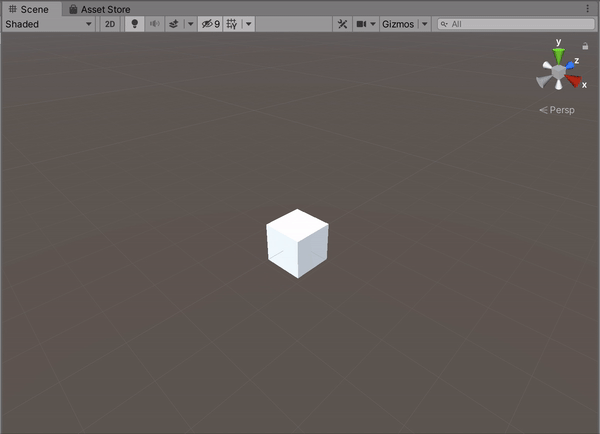

**The University of Melbourne**
# COMP30019 – Graphics and Interaction

# Project-1 README

Remember that _"this document"_ should be `well written` and formatted **appropriately**. It should be easily readable within Github. Modify this file... 
this is just an example of different formating tools available for you. For help with the format you can find a guide [here](https://docs.github.com/en/github/writing-on-github).

## Table of contents
* [Team Members](#team-members)
* [General Info](#general-info)
* [Technologies](#technologies)
* [Diamond-Square implementation](#diamond-square-implementation)
* [Camera Motion](#camera-motion)
* [Vertex Shader](#vertex-shader)
* [Median Filter](#median-filter)

## Team Members

| Name | Task | State |
| :---         |     :---:      |          ---: |
| Nathan Rearick  | Diamond Square     |   |
| Nathan Rearick  | Camera Movement     |   |
| Lucien Lu    | Water and Water Shader      |   |
| Lucien Lu    | Scene Manager    |   |
| Lucien Lu    | Median Filter    |   |
| Timmy Truong    | Shaders     |   |
| Timmy Truong    | Sun     |   |

## General info
This is project - 1 ...
Project 1 is an implementation of the Diamond Square algorithm and custom HLSL shaders that demonstrates phong shading. This project is based on generating a fractal landscape using the DS algorithm. This implementation is made by, Lucien Lu, Nathan Rearick, Timmy Truong.
	
## Technologies
Project is created with:
* Unity 2019.4.3f1

## Diamond-Square implementation
For the Diamond Square algorithm, the corners of the grid is set to a random value in a specified range. Then the centre of these 4 points is set to the average of the heights of the corners, this is known as the diamond step. Then for each 'diamond', the center of the vertices is set to the average of the diamond's points (Note: For points on the edge, only 3 points are used), this is the square step. After both of these steps are completed, the grid is then split into 4 equally sized grids, and the algorithm repeats for each grid. This processes continues until the size of each grid has a side length of 1, which results in every point in the original grid to be designated a specific height.

This section of code shows the use of a double nested for loop which will inspect every grid in the original grid, conduct both steps on itself, then essentially 'splits' into 4 smaller grids, this is repeated n amount of times. The reason why the original square grid has to have ((2^n) + 1) points per row is because it is the only set of dimensions that allow for the grid to evenly divide into 4 smaller grids until each length is 1.
```c#
    for(int i = 0; i < nVal; i++)
		{
            int sqrtSquares = (int)Math.Pow(2, i);
            float divided = (gridSize - 1) / sqrtSquares;
            for(int j = 0; j < sqrtSquares; j++)
			{
		//  Every row of squares
                for(int k = 0; k < sqrtSquares; k++)
				{
		    //  Every square in the row
                    Vector2 p1 = new Vector2(k, j) * divided;
                    Vector2 p3 = new Vector2(k + 1, j + 1) * divided;
                    Step(p1, p3);
				}
			}
            LowerHeight();
		}
```
A single method was used to find the average height of related points:
To find the few corner points of interest, a displacement vector between a given corner and the local centre point of the grid is created. The corners are found by adding the deplacement vector with the local centre point, then rotating the displacement vector by 90 degrees after each time. If the inspected point is inside the original grid, its height is then added to a sum, so that the mean of the valid points can be calculated. Thus, the new point's height will equal to the mean height of these points, plus a random value (the range of this random value decreases after every full loop).

Code:

```c#
    float AverageHeight(Vector2 pV, Vector2 mp)
	{
        float sum = 0;
        int count = 0;

        //  Get the displacement vector between the mid point and the corner point
        Vector2 dV = pV - mp;

        float[] angles = new[] {
            0f, Mathf.PI * 0.5f, Mathf.PI, Mathf.PI * 1.5f
        };
        foreach (float theta in angles)
        {
            Vector2 translation = rotateVector(dV, theta);
            Vector2 newV = pV + translation;
            if (inBounds(newV))
			{
                sum += verts.GetHeight(newV);
                count++;
			}
		}
        if(count == 0)
		{
            return 0;
		}
        return sum / count;
	}
    Vector2 rotateVector(Vector2 v, float theta)
    {
        return new Vector2(Mathf.Round((v.x * Mathf.Cos(theta)) - (v.y * Mathf.Sin(theta))), 
            Mathf.Round((v.x * Mathf.Sin(theta)) + (v.y * Mathf.Cos(theta))));
    }
 ```

## Camera Motion

You can use images/gif by adding them to a folder in your repo:

<p align="center">
  
</p>

To create a gif from a video you can follow this [link](https://ezgif.com/video-to-gif/ezgif-6-55f4b3b086d4.mov).


## Vertex Shader

You can use emojis :+1: but do not over use it, we are looking for professional work. If you would not add them in your job, do not use them here! :shipit:

**Now Get ready to complete all the tasks:**

- [x] Read the handout for Project-1 carefully
- [x] Modelling of fractal landscape
- [x] Camera motion 
- [x] Surface properties
- [ ] Project organisation and documentation

## Median Filter

We decided to add an optional Median Filter to the terrain generation. This will increase computation time and loading time by approximately 1 second but results in a much smoother surface.
<p align="left">
  
</p>
<p align="right">
  
</p>

```c#
void MedianFilter()
    {
        var window = new List<float>();
        float newHeight;

        int checkWindowOffsetX;
        int checkWindowOffsetY;
        
        int adjustedWindowWidthX;
        int adjustedWindowWidthY;

		HeightGrid copy = verts.Copy();

        for (int x = 0; x < gridSize; x++)
        {
            adjustedWindowWidthX = GetAdjustedWindowWidth(x);
            checkWindowOffsetX = GetWindowOffset(x);
            for (int y = 0; y < gridSize; y++)
            {
                adjustedWindowWidthY = GetAdjustedWindowWidth(y);
                checkWindowOffsetY = GetWindowOffset(y);
                for (int fx = 0; fx < adjustedWindowWidthX; fx++)
                {
                    for (int fy = 0; fy < adjustedWindowWidthY; fy++)
                    {
                        window.Add(copy.GetHeight(new Vector2(x + fx - checkWindowOffsetX, y + fy - checkWindowOffsetY)));
                    }
                }
                window.Sort();
                newHeight = window[adjustedWindowWidthX * adjustedWindowWidthY / 2];

                verts.SetHeight(new Vector2(x, y), newHeight);
                
                window.Clear();
            }
        }
    }
```
